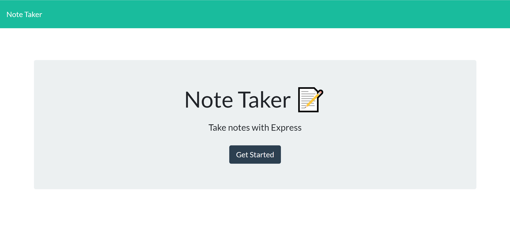
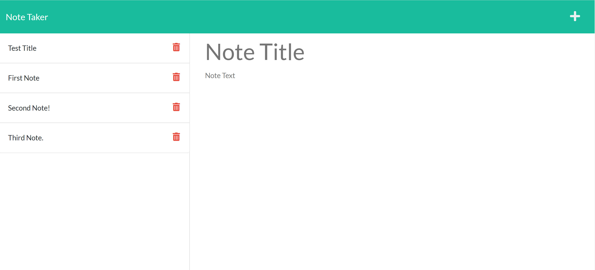

# Note Taker
  # Mark S. Moore
  E-mail: msmo1960@gmail.com
  
---
## Description 
The project allows a user to take notes.  It writes the notes and saves them automatically.

User Story  
 
AS A small business owner 
I WANT to be able to write and save notes 
SO THAT I can organize my thoughts and keep track of tasks I need to complete 
 
Acceptance Criteria 
 
GIVEN a note-taking application 
WHEN I open the Note Taker 
THEN I am presented with a landing page with a link to a notes page 
WHEN I click on the link to the notes page 
THEN I am presented with a page with existing notes listed in the left-hand column, plus empty fields to enter a new note title and the note’s text in the right-hand column 
WHEN I enter a new note title and the note’s text 
THEN a Save icon appears in the navigation at the top of the page 
WHEN I click on the Save icon 
THEN the new note I have entered is saved and appears in the left-hand column with the other existing notes 
WHEN I click on an existing note in the list in the left-hand column 
THEN that note appears in the right-hand column 
WHEN I click on the Write icon in the navigation at the top of the page 
THEN I am presented with empty fields to enter a new note title and the note’s text in the right-hand column 

---
## Table of Contents
---
* [Installation](#Installation)
* [Usage](#Usage)
* [License](#License)
* [Badges](#Badges)
* [Contributing](#Contributors)
* [Tests](#Tests)
* [Questions](#Questions)
---
## Installation
It was created on Heroku.
---
## Usage 
To create notes for any reason.

The deployed application: https://stark-scrubland-23380.herokuapp.com/ 

The GitHub site: https://github.com/marksmoore/Note-Taker

---
## License
This project is licensed under the MIT License license.
[Click here for MIT License information.](https://mit-license.org/)
---
## Badges

---
## Contributing
1 Contributor(s)
---
## Tests
Created notes as a test.
---
## Questions
Please see my GitHub at (https://github.com/marksmoore) or by email at msmo1960@gmail.com

